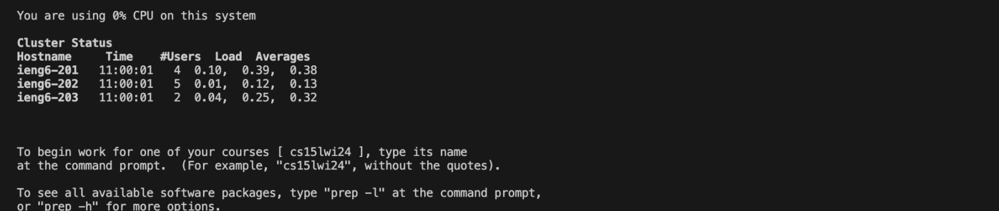
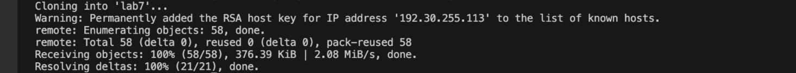
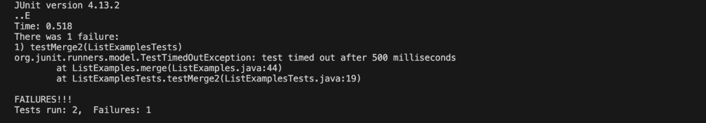
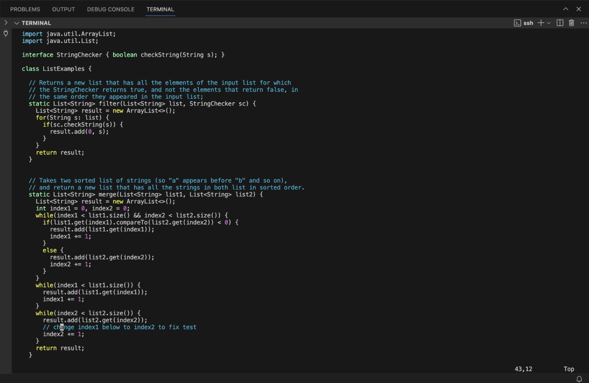
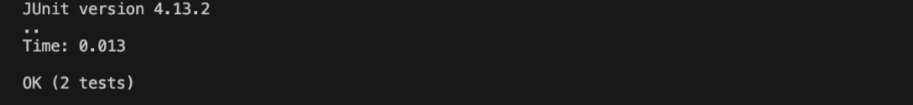

# Lab Report 4 - Vim
## This lab report has steps 4 to 9 from week 7 lab

STEP 4: Log into ieng6 using command:
`ssh janeja@ieng6.ucsd.edu`

Keys pressed: `<enter>`

STEP 5: Clone the forked repository from GitHub account:
`git clone git@github.com:jia-aneja/lab7.git`

Keys pressed: `git` `<space>` `clone` `<space>` `Ctrl V`
I pasted the `ssh` url that I copied after forking the repository.

STEP 6: Running the tests:
`bash test.sh`

Keys pressed: `cd` `<space>` `la` `<tab>` `<enter>` `bash` `t` `<tab>` `<enter>`
Entered into lab7/ directory then ran the bash command

STEP 7: Editing code to fix the test that is failing

Keys pressed: `vim` `<space>` `L` `<tab>` `<space>` `.` `<tab>` `<enter>` `43 j` `11 l` `x` `i` `2` `<escape>` `:wq!`
Typed vim then tabbed into the `ListExamples.java` file opening it in the vim editor
pressing `43 j` moved the cursor to the line to be edit. 
`11 l` moved the cursor to the character that was to be changed
pressing `x` deleted that character, pressing `i` entered the insert mode
changed the character to 2 exited the insert mode using the escape key.
Typed `:wq!` to save and exit.

STEP 8: Running the tests after correcting the file
`bash test.sh`

Keys pressed: `<up>` `<up>` `<up>` `<enter>`
Used up arrow to access the command from the terminal

STEP 9: Committing file into github
`git add ListExamples.java`
`git commit -m "lab"

*My VS Code crashed and suddenly stopped working so I couldn't add the last screenshot. There is some issue with my laptop. 
I knew the commands I used so I could write the keys pressed.*

Keys pressed: `git` `<space>` `add` `L` `<tab>` `<enter>` `git` `<space>` `commit` `<space>` `-m` `<space>` `"lab"` `<enter>`

***
